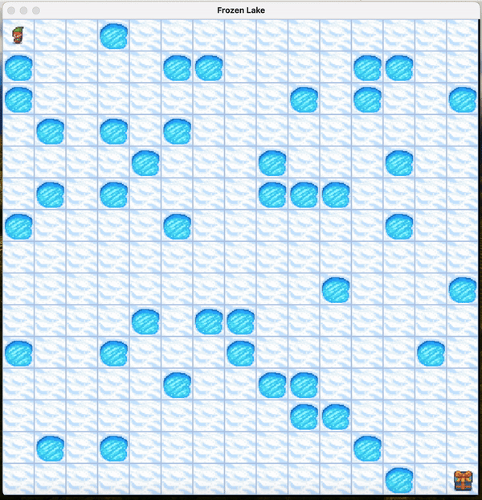

# TMDP: Teleport Markov Decision Process



## Introduction

Deep Reinforcement Learning (DRL) has revolutionized complex decision-making tasks, but still faces challenges in environments with sparse rewards, high-dimensional spaces, and long-term credit assignment issues. This project introduces the Teleport Markov Decision Processes (TMDPs) framework, which enhances the exploration capabilities of RL agents through a teleportation mechanism, contributing to more effective curriculum learning.

## The Teleport MDP Framework

A Teleport MDP extends the traditional Markov Decision Process (MDP) by adding a teleportation mechanism. It allows an agent to be relocated to any state during an episode, controlled by:

- Teleport rate (τ): Determines the frequency of teleportation
- State teleport probability distribution (ξ): Dictates the possible states for teleportation

### The Curriculum

TMDPs start with a high teleport rate for wide exploration, gradually reducing it to increase task complexity and converge towards the original problem formulation.

### Mathematical Formulation

A TMDP is defined by the tuple M=⟨S,A,P,R,γ,μ,τ,ξ⟩, where:

- S: State space
- A: Action space
- P(s′∣s,a): Transition probability model
- R(s,a): Reward function
- γ: Discount factor
- μ: Initial state distribution
- τ: Teleport rate
- ξ: Teleport probability distribution

The transition model in TMDP is defined as:

Pτ(s′∣s,a)=(1−τ)P(s′∣s,a)+τξ(s′)

## Practical Algorithms

We developed several algorithms integrating teleport-based curricula:

1. Teleport Model Policy Iteration (TMPI)
2. Static Teleport (S-T)
3. Dynamic Teleport (D-T)

## Experimental Evaluation

We conducted experiments using two RL environments:

1. Frozen Lake
2. River Swim

Results demonstrated that TMDP-based algorithms consistently outperformed their vanilla counterparts in both environments.

## Conclusion

The Teleport MDP framework offers a flexible and effective approach to curriculum design in reinforcement learning, reducing reliance on domain-specific expertise and improving learning efficiency.

## Co-Authors

This research was conducted in collaboration with:

- Prof. Marcello Restelli
- Dr. Alberto Maria Metelli
- Dr. Luca Sabbioni

## References

1. Andrychowicz, M., et al. (2017). Hindsight experience replay.
2. Florensa, C., et al. (2017). Reverse curriculum generation for reinforcement learning.
3. Kakade, S. M., & Langford, J. (2002). Approximately optimal approximate reinforcement learning.
4. Metelli, A. M., et al. (2018). Configurable Markov decision processes.
5. Schulman, J., et al. (2017). Proximal policy optimization algorithms.
6. Bengio, Y., et al. (2009). Curriculum learning.

## Usage

The template is based on [UV](https://docs.astral.sh/) as package manager and [Just](https://github.com/casey/just) as command runner. You need to have both installed in your system to use this template.

Once you have those, you can just run

```bash
just dev-sync
```

to create a virtual environment and install all the dependencies, including the development ones. If instead you want to build a "production-like" environment, you can run

```bash
just prod-sync
```

In both cases, all extra dependencies will be installed (notice that the current pyproject.toml file has no extra dependencies).

You also need to install the pre-commit hooks with:

```bash
just install-hooks
```

### Formatting, Linting and Testing

You can configure Ruff by editing the `.ruff.toml` file. It is currently set to the default configuration.

Format your code:

```bash
just format
```

Run linters (ruff and mypy):

```bash
just lint
```

Run tests:

```bash
just test
```

Do all of the above:

```bash
just validate
```

### Executing

The code is a simple hello world example, which just requires a number as input. It will output the sum of the provided number with a random number.
You can run the code with:

```bash
just run 5
```

### Docker

The template includes a multi stage Dockerfile, which produces an image with the code and the dependencies installed. You can build the image with:

```bash
just dockerize
```

### Github Actions

The template includes two Github Actions workflows.

The first one runs tests and linters on every push on the main and dev branches. You can find the workflow file in `.github/workflows/main-list-test.yml`.

The second one is triggered on every tag push and can also be triggered manually. It builds the distribution and uploads it to PyPI. You can find the workflow file in `.github/workflows/publish.yaml`.

## Greetings
A big thank you to [Giovanni Giacometti](https://github.com/GiovanniGiacometti) for creating this template and sharing it with the community. This template is a fork of his original work, which can be found at [giovannigiacometti/python-repository-template](https://github.com/GiovanniGiacometti/python-repo-template).